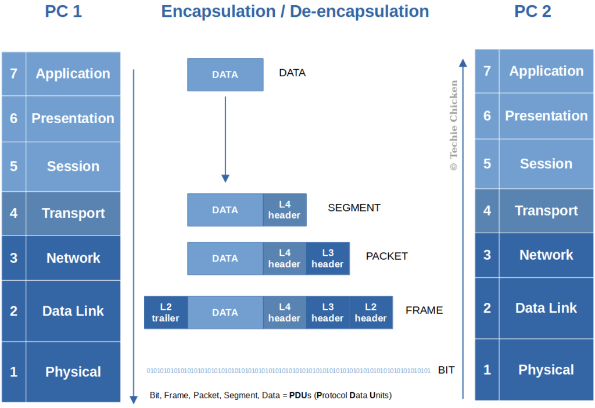

# OSI Model (Open Systems Interconnection)

---

## Table of Contents
1. [Introduction](#introduction)
   - [What is the OSI Model?](#what-is-the-osi-model)
   - [Importance of OSI in Networking](#importance-of-osi-in-networking)
2. [History of the OSI Model](#history-of-the-osi-model)
   - [Origin and Development by ISO](#origin-and-development-by-iso)
   - [Evolution of Networking Standards](#evolution-of-networking-standards)
   - [Why OSI was Needed](#why-osi-was-needed)
3. [Overview of OSI Model Layers](#overview-of-osi-model-layers)
   - [Layered Architecture Concept](#layered-architecture-concept)
   - [Benefits of Layered Approach](#benefits-of-layered-approach)
4. [Detailed Explanation of Each Layer](#detailed-explanation-of-each-layer)
   - [Layer 1: Physical Layer](#layer-1-physical-layer)
   - [Layer 2: Data Link Layer](#layer-2-data-link-layer)
   - [Layer 3: Network Layer](#layer-3-network-layer)
   - [Layer 4: Transport Layer](#layer-4-transport-layer)
   - [Layer 5: Session Layer](#layer-5-session-layer)
   - [Layer 6: Presentation Layer](#layer-6-presentation-layer)
   - [Layer 7: Application Layer](#layer-7-application-layer)
5. [How Data Travels Through the OSI Layers](#how-data-travels-through-the-osi-layers)
   - [Encapsulation and Decapsulation](#encapsulation-and-decapsulation)
   - [Step-by-Step Example of a Web Request](#step-by-step-example-of-a-web-request)
6. [Comparison with TCP/IP Model](#comparison-with-tcpip-model)
   - [Differences and Similarities](#differences-and-similarities)
   - [How OSI Maps to TCP/IP](#how-osi-maps-to-tcpip)
7. [Practical Applications of OSI Model](#practical-applications-of-osi-model)
   - [Troubleshooting Network Issues](#troubleshooting-network-issues)
   - [Protocol Design and Implementation](#protocol-design-and-implementation)
   - [Networking Certifications](#networking-certifications)
8. [Common Misconceptions About OSI](#common-misconceptions-about-osi)
   - [OSI vs Reality](#osi-vs-reality)
   - [Layer Responsibilities Confusion](#layer-responsibilities-confusion)
9. [Conclusion](#conclusion)
   - [Recap of Key Points](#recap-of-key-points)
   - [Why OSI Still Matters Today](#why-osi-still-matters-today)
10. [References & Further Reading](#references--further-reading)

---

## Introduction

The OSI (Open Systems Interconnection) Model is a **conceptual framework** used to understand how computers and devices communicate over a network. It divides network communication into **seven distinct layers**, each with its own role, to make networking easier to understand and manage.

### What is the OSI Model?

At its core, the OSI Model is a **blueprint for network communication**. Instead of viewing networking as a single process, it separates the tasks of sending and receiving data into layers:

1. **Physical Layer** – Handles the raw transmission of bits across physical media like cables or wireless signals.  
2. **Data Link Layer** – Ensures that data frames are delivered correctly within a local network, handling error detection and control.  
3. **Network Layer** – Determines the best path for data to travel across different networks using logical addressing.  
4. **Transport Layer** – Guarantees that data reaches its destination reliably or, if reliability is not required, as quickly as possible.  
5. **Session Layer** – Manages connections between applications, allowing them to open, use, and close communication sessions.  
6. **Presentation Layer** – Translates data into a usable format, including encryption and compression.  
7. **Application Layer** – Provides network services directly to end-user applications like web browsers or email clients.  

> Think of it like sending a parcel: each layer has its own responsibility, from packaging and labeling to delivery and finally opening the package at the destination.

### Importance of OSI in Networking

The OSI Model is **critical for understanding, designing, and troubleshooting networks**:

- **Standardization:** Provides a universal framework so devices and software from different vendors can communicate.  
- **Troubleshooting:** Allows network engineers to isolate problems layer by layer.  
- **Protocol Development:** Guides the creation of protocols that fit specific layers without disrupting other parts of the network.  
- **Education:** Makes complex networking concepts easier to learn and understand.  

Each layer builds on the one below it, creating a **clear, organized structure** for understanding how data flows. This layered approach ensures that networks are **predictable, manageable, and scalable**, which is why the OSI Model remains fundamental in networking education and practice today.

---

## History of the OSI Model

The OSI Model did not appear out of nowhere. It was developed as part of a global effort to **standardize networking and ensure interoperability** between different computer systems. Understanding its history helps appreciate why the model exists and how it shaped modern networking.

### Origin and Development by ISO

The OSI Model was created by the **International Organization for Standardization (ISO)** in the late 1970s and early 1980s. ISO aimed to develop a **universal standard** that could guide the design of network protocols and ensure that devices from different vendors could communicate effectively.  

The project involved collaboration among engineers, researchers, and organizations worldwide. The OSI Model became a **reference framework**, rather than a protocol itself, which meant it defined **how networking should work conceptually** without being tied to specific technologies.

### Evolution of Networking Standards

Before OSI, networking was **fragmented**, with many proprietary systems that could not easily communicate. Early protocols were often specific to a single manufacturer or type of hardware.  

With the OSI Model, the networking world adopted a **layered approach**, which allowed protocols to be developed independently for each layer. This modular approach encouraged **innovation**, simplified **troubleshooting**, and eventually influenced the development of the **TCP/IP protocol suite** that dominates the Internet today.

### Why OSI was Needed

The OSI Model addressed several critical challenges in networking:

1. **Interoperability:** Different devices and software needed a common framework to communicate.  
2. **Complexity Management:** Networking involves many tasks; the OSI Model separated them into manageable layers.  
3. **Protocol Standardization:** Engineers needed a blueprint to design new protocols without conflicting with existing ones.  
4. **Educational Tool:** A clear model helped train new network engineers and provided a common vocabulary for networking concepts.  

In essence, the OSI Model **provided order to a chaotic landscape** of networking systems and protocols, paving the way for reliable, scalable, and interoperable networks.

---

## Overview of OSI Model Layers

The OSI Model organizes network communication into **seven distinct layers**, each with a specific function. This structured approach allows networks to be **modular, interoperable, and easier to troubleshoot**. Understanding the concept behind layers is essential before diving into the details of each one.

### Layered Architecture Concept

The layered architecture of the OSI Model is based on the idea that **network tasks can be divided into smaller, more manageable pieces**. Each layer has a clear responsibility and communicates only with the layers directly above or below it.  

This approach ensures that changes or improvements in one layer do not affect the entire network system. For example:

- If a new encryption method is introduced at the Presentation Layer, it does not require changes to the Transport Layer or Network Layer.  
- Routing algorithms at the Network Layer can be updated without affecting the Application Layer.  

By separating responsibilities, the OSI Model **simplifies the design, maintenance, and understanding of networks**.

### Benefits of Layered Approach

The layered structure of the OSI Model offers several key benefits:

1. **Modularity:** Each layer can be developed, tested, and updated independently.  
2. **Interoperability:** Devices and software from different vendors can communicate if they follow the same layer specifications.  
3. **Simplified Troubleshooting:** Problems can be isolated to a specific layer, making network issues easier to identify and resolve.  
4. **Protocol Standardization:** Protocols are designed to fit into specific layers, which reduces conflicts and complexity.  
5. **Educational Clarity:** The layered approach provides a clear framework for learning networking concepts step by step.  

In essence, the OSI Model’s layered architecture acts like a **blueprint for network communication**, showing how different parts of a network interact and depend on one another, while keeping the overall system organized and scalable.

---

## Detailed Explanation of Each Layer

Before diving into the details, here’s a **quick reference table** of the OSI layers, their main function, and examples:

| Layer Number | Layer Name          | Main Function                                   | Examples / Protocols               |
|--------------|-------------------|-----------------------------------------------|----------------------------------|
| 7            | Application        | Interfaces with user applications            | HTTP, FTP, SMTP, DNS             |
| 6            | Presentation       | Data translation, encryption, compression    | JPEG, SSL/TLS, ASCII             |
| 5            | Session            | Manages sessions and connections             | NetBIOS, RPC                     |
| 4            | Transport          | Reliable or unreliable data delivery         | TCP, UDP                          |
| 3            | Network            | Routing and logical addressing               | IP, ICMP, IPsec                   |
| 2            | Data Link          | Error detection, frame delivery               | Ethernet, PPP, Switches          |
| 1            | Physical           | Transmission of raw bits over physical media | Cables, Hubs, Wi-Fi               |

### Layer 1: Physical Layer

The **Physical Layer** is the foundation of the OSI Model. It defines **how raw bits are transmitted over physical media**, such as electrical signals, light pulses, or radio waves. This layer is **entirely concerned with hardware**, including cables, switches, hubs, network interface cards, and wireless access points.  

Key points:  
- Transmits 0s and 1s as signals.  
- Defines **voltage levels, pin layouts, and cable types**.  
- Deals with **bandwidth, data rate, and physical topology**.  

Example: When you connect your computer to a router with an Ethernet cable, the Physical Layer ensures the electrical signals are sent and received correctly.

### Layer 2: Data Link Layer

The **Data Link Layer** provides **error detection and reliable frame delivery** between devices on the same network. It essentially transforms the raw bit stream from the Physical Layer into **data frames**, which can be recognized and verified by receiving devices.  

Key points:  
- Divided into **MAC (Media Access Control) and LLC (Logical Link Control)** sublayers.  
- Handles **error detection/correction**, flow control, and **frame sequencing**.  
- Provides **physical addressing** through MAC addresses.  

Example: Ethernet is a classic Data Link Layer protocol. Switches operate at this layer, forwarding frames based on MAC addresses.

### Layer 3: Network Layer

The **Network Layer** is responsible for **logical addressing and routing** data across different networks. This layer decides **how data reaches its destination**, even if it has to pass through multiple intermediate devices.  

Key points:  
- Provides **logical addresses** (e.g., IP addresses).  
- Determines the **best path** for data using routing algorithms.  
- Handles **packet forwarding, fragmentation, and reassembly**.  

Example: IP (Internet Protocol) operates at this layer. Routers use this layer to forward packets to other networks.

### Layer 4: Transport Layer

The **Transport Layer** ensures **reliable or efficient delivery of data** between applications on two devices. It manages **segmentation, flow control, and error recovery**.  

Key points:  
- **TCP** provides reliable, connection-oriented communication.  
- **UDP** provides fast, connectionless communication.  
- Reassembles data segments into complete messages for the upper layers.  

Example: When you load a webpage, TCP ensures all packets arrive in the correct order, while UDP is used for streaming where speed is more important than perfect accuracy.

### Layer 5: Session Layer

The **Session Layer** manages **connections (sessions) between applications**. It establishes, maintains, and terminates communication sessions.  

Key points:  
- Controls **dialogue between two systems**, e.g., half-duplex or full-duplex.  
- Handles **session checkpoints** and recovery.  
- Supports synchronization for long transactions.  

Example: Online banking sessions use this layer to maintain continuous communication while encrypting credentials and transaction data.

### Layer 6: Presentation Layer

The **Presentation Layer** is responsible for **data translation, formatting, encryption, and compression**. It ensures that the data sent by the Application Layer is understandable by the receiving system.  

Key points:  
- Converts data from **one format to another** (e.g., ASCII to EBCDIC).  
- Performs **encryption/decryption** for secure transmission.  
- Compresses data to improve network efficiency.  

Example: HTTPS uses SSL/TLS at this layer to encrypt data, ensuring secure communication between a browser and a server.

### Layer 7: Application Layer

The **Application Layer** is the closest layer to the end-user. It provides **network services directly to applications**, allowing software to communicate over the network.  

Key points:  
- Interfaces with **email clients, web browsers, and file transfer programs**.  
- Defines protocols for specific **user-facing services**.  
- Relies on lower layers to transmit data correctly.  

Example: Sending an email with SMTP or browsing a website using HTTP/HTTPS happens at this layer.

This chapter provides a **comprehensive, layer-by-layer understanding** of the OSI Model, showing how each layer contributes to reliable, organized, and efficient network communication.

---

## How Data Travels Through the OSI Layers

Data does not just magically travel from one computer to another. It passes **through all seven OSI layers**, being **packaged, addressed, transmitted, and unpackaged** along the way. This process is called **encapsulation** on the sending side and **decapsulation** on the receiving side.

### Encapsulation and Decapsulation

**Encapsulation** is the process of **wrapping data with the necessary protocol information** as it moves down the OSI layers. Each layer adds its own header (and sometimes a trailer) to ensure the data is handled correctly.  

**Decapsulation** is the reverse: as data moves up the OSI layers on the receiving side, each layer **removes its corresponding header/trailer** and processes the data.

Here’s a visual representation of the process:

**Key points to understand:**

1. **Each layer has its own header/trailer** with information specific to that layer (e.g., IP addresses at Network Layer, port numbers at Transport Layer).  
2. **The Physical Layer only sees bits**, not headers or payloads.  
3. **Encapsulation ensures reliability and organization**, while decapsulation ensures the receiver interprets the data correctly.

### Step-by-Step Example of a Web Request

Let’s say you open a website in your browser (HTTP request):

1. **Application Layer:** You type `www.example.com`. The browser creates the HTTP request.  
2. **Presentation Layer:** Data is encrypted using TLS/SSL if it’s HTTPS.  
3. **Session Layer:** A session is established to manage this communication.  
4. **Transport Layer:** TCP splits the request into segments and adds port numbers.  
5. **Network Layer:** IP addresses are added so routers know where to send the data.  
6. **Data Link Layer:** Ethernet frames are created with MAC addresses for delivery on the local network.  
7. **Physical Layer:** Bits are transmitted over the cable or Wi-Fi.

**At the receiving server:**  
The server **decapsulates** the data, removing headers layer by layer until the HTTP request reaches the Application Layer, where the web server processes it.

This version **uses your image** for clear visualization while keeping all explanations intact.

---

## Comparison with TCP/IP Model

### Differences and Similarities
<!-- Content goes here -->

### How OSI Maps to TCP/IP
<!-- Content goes here -->

## Practical Applications of OSI Model

### Troubleshooting Network Issues
<!-- Content goes here -->

### Protocol Design and Implementation
<!-- Content goes here -->

### Networking Certifications
<!-- Content goes here -->

## Common Misconceptions About OSI

### OSI vs Reality
<!-- Content goes here -->

### Layer Responsibilities Confusion
<!-- Content goes here -->

## Conclusion

### Recap of Key Points
<!-- Content goes here -->

### Why OSI Still Matters Today
<!-- Content goes here -->

## References & Further Reading
<!-- Content goes here -->
