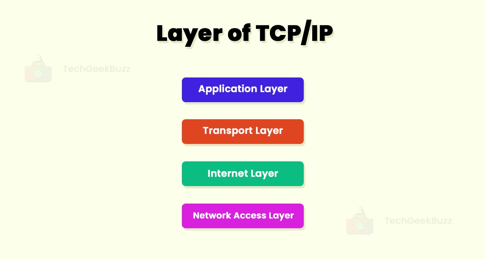

# TCP/IP Model

---

# Table of Contents – TCP/IP Model

1. [Introduction](#introduction)  
   - [What is the TCP/IP Model?](#what-is-the-tcpip-model)  
   - [Importance of TCP/IP in Modern Networking](#importance-of-tcpip-in-modern-networking)  

2. [History of TCP/IP](#history-of-tcpip)  
   - [Origins in ARPANET](#origins-in-arpanet)  
   - [Adoption as the Internet Standard](#adoption-as-the-internet-standard)  

3. [Overview of TCP/IP Layers](#overview-of-tcpip-layers)  
   - [The Four Layers](#the-four-layers)  
   - [Comparison with OSI](#comparison-with-osi)  

4. [Detailed Explanation of Each Layer](#detailed-explanation-of-each-layer)  
   - [Application Layer](#application-layer)  
   - [Transport Layer](#transport-layer)  
   - [Internet Layer](#internet-layer)  
   - [Network Access Layer](#network-access-layer)  

5. [How Data Moves Through TCP/IP](#how-data-moves-through-tcpip)  
   - [Encapsulation in TCP/IP](#encapsulation-in-tcpip)  
   - [Example: Sending an Email](#example-sending-an-email)  

6. [TCP/IP in the Real World](#tcpip-in-the-real-world)  
   - [Common Protocols (HTTP, TCP, IP, etc.)](#common-protocols-http-tcp-ip-etc)  
   - [Why TCP/IP Dominates Networking](#why-tcpip-dominates-networking)  

7. [Conclusion](#conclusion)  
   - [Key Takeaways](#key-takeaways)  
   - [Why TCP/IP Matters Today](#why-tcpip-matters-today)  

8. [References & Further Reading](#references--further-reading)  
