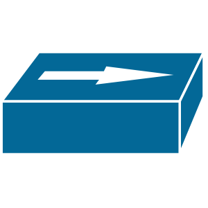
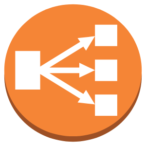

# Computer Networking 🌐

This repository covers the basics of computer networking. It is designed to introduce you to the fundamentals and essential concepts, helping you take your first steps into the vast world of networking.

---

## Table of Contents

1. [Introduction](#introduction)
   - [Definition of Computer Network](#definition-of-computer-network)
   - [Why Networks are Important](#why-networks-are-important)
   - [Basic Networking Terms](#basic-networking-terms)
2. [Types of Computer Networks](#types-of-computer-networks)
3. [Network Devices](#network-devices)
4. [Network Communication Types](#network-communication-types)
5. [Core Networking Concepts](#core-networking-concepts)
   - [Network Interface Card (NIC)](#network-interface-card-nic)
   - [MAC Address](#mac-address)
   - [IP Address Basics](#ip-address-basics)
   - [IP Address Allocation](#ip-address-allocation)
   - [Types of IP Addresses](#types-of-ip-addresses)
6. **IP Addressing and Subnetting**
   - IPv4, IPv6, Subnetting, VLSM, CIDR, MAC Address
7. **Protocols**
   - TCP, UDP, TCP/IP, DHCP, DNS
8. **Routing & Switching Concepts**
   - Routers, Routing Table, Switches, VLAN
9. **OSI Model**
   - Overview, Layer 1-7
10. **Network Services**
   - NAT, Gateways, QoS, Load Balancing
   - VPN, Cloud Networking, Wireless Networking
11. **Network Security**
    - Firewall, Network Security Basics
12. **Network Data Units**
    - Frames, Packets, Segments, Ports
13. **Troubleshooting & Monitoring**
    - Network Troubleshooting, Monitoring Tools
---

## Introduction

### Definition of Computer Network
A **computer network** is a collection of interconnected devices such as computers, servers, and other hardware that communicate with each other to share resources, exchange information, and enable collaboration. Networks can be small, like a home network connecting a few devices, or large, spanning cities or even countries.  

By allowing devices to communicate, networks make it possible to share files, access the internet, run applications remotely, and coordinate complex systems efficiently.

### Why Networks are Important
Computer networks are the backbone of modern digital life. They allow businesses, schools, governments, and individuals to:

- **Share Resources:** Printers, storage devices, and internet connections can be shared among multiple users.  
- **Communicate Quickly:** Email, messaging apps, and video calls rely on networks to transmit information instantly.  
- **Access Remote Services:** Cloud computing, web applications, and online databases require a reliable network connection.  
- **Enable Collaboration:** Teams can work together in real time, regardless of geographic location.  
- **Support Scalability:** Networks allow organizations to grow by adding new devices and services without disrupting existing systems.

In short, networks make modern computing fast, flexible, and efficient.

### Basic Networking Terms
To get started with networking, here are some foundational terms:

- **Node / Host:** Any device connected to a network (computer, server, printer, etc.).  
- **Link / Connection:** The physical or wireless medium that connects devices.  
- **Protocol:** A set of rules that devices follow to communicate correctly. Examples include TCP/IP, UDP, and HTTP.  
- **Bandwidth:** The maximum amount of data that can be transmitted over a network in a given time.  
- **Latency:** The delay between sending and receiving data.  
- **Packet:** A small unit of data sent across a network.  
- **MAC Address:** A unique identifier assigned to each network device.  
- **IP Address:** A numerical label that identifies a device on a network.

> These concepts form the building blocks of networking. As you progress through this guide, you will see how they work together to create powerful, reliable networks.

---

## Types of Computer Networks

Computer networks come in different types because organizations, individuals, and devices have varying needs for **coverage, speed, cost, and connectivity**. Networks are grouped based on **geographic area, purpose, and technology**:

- **Small-scale networks:** Serve a single user or a small area (e.g., PAN, LAN).  
- **Medium-scale networks:** Connect multiple buildings or a city (e.g., CAN, MAN).  
- **Large-scale networks:** Span countries or the globe (e.g., WAN, GAN, VPN).  

Each network type is designed to **solve specific challenges** such as local connectivity, long-distance communication, secure remote access, or high-speed data sharing. Choosing the right type ensures **efficient communication, security, and resource sharing**.

### Common Network Types

| Network Type | Short Description | Solution Provided | Expanded Explanation |
|-------------|------------------|-----------------|--------------------|
| **LAN (Local Area Network)** | Connects devices in a small area like a home, office, or school. | High-speed connectivity for local users, resource sharing, and collaboration. | [LAN - GeeksforGeeks](https://www.geeksforgeeks.org/local-area-network-lan/) |
| **WAN (Wide Area Network)** | Connects multiple LANs over large geographic areas. | Enables organizations to communicate across cities, countries, or continents. | [WAN - GeeksforGeeks](https://www.geeksforgeeks.org/wide-area-network-wan/) |
| **MAN (Metropolitan Area Network)** | Spans a city or campus. | Connects multiple buildings for efficient city-wide communication. | [MAN - GeeksforGeeks](https://www.geeksforgeeks.org/metropolitan-area-network-man/) |
| **PAN (Personal Area Network)** | Connects devices within a personal workspace, like Bluetooth. | Allows personal devices to communicate over short distances. | [PAN - GeeksforGeeks](https://www.geeksforgeeks.org/personal-area-network-pan/) |
| **WLAN (Wireless LAN)** | Wireless version of a LAN. | Provides mobility and flexibility for local users without physical cables. | [WLAN - GeeksforGeeks](https://www.geeksforgeeks.org/wireless-local-area-network-wlan/) |
| **CAN (Campus Area Network)** | Connects networks across a campus (e.g., university or business complex). | Centralized communication and resource sharing for multiple buildings. | [CAN - GeeksforGeeks](https://www.geeksforgeeks.org/campus-area-network-can/) |
| **SAN (Storage Area Network)** | Network dedicated to connecting storage devices. | High-speed access and management of shared storage resources. | [SAN - GeeksforGeeks](https://www.geeksforgeeks.org/storage-area-network-san/) |
| **VPN (Virtual Private Network)** | Securely connects remote users to a private network over the internet. | Encrypted communication for remote access to private networks. | [VPN - GeeksforGeeks](https://www.geeksforgeeks.org/virtual-private-network-vpn/) |
| **GAN (Global Area Network)** | Connects networks around the world. | Enables worldwide data sharing and global communication. | [GAN - GeeksforGeeks](https://www.geeksforgeeks.org/global-area-network-gan/) |

---

## Network Devices

Network devices are the **building blocks of any computer network**. They manage, direct, and control the flow of data between devices, ensuring communication is fast, secure, and efficient. Without these devices, networks would not function properly  data could get lost, collisions could occur, or communication might not even be possible.  

Each network device serves a specific role. Some simply **extend the reach** of the network, like repeaters, while others **direct traffic intelligently**, like routers. Firewalls protect networks from unauthorized access, switches make communication more efficient by sending data only to the intended device, and virtual devices allow modern cloud and virtualized environments to operate smoothly.  

Understanding these devices is fundamental for anyone learning networking because they **form the infrastructure that enables connectivity, communication, and security**.

### Common Network Devices

| Network Device | Visual Look | Description | Role | How It Works | Expanded Explanation |
|----------------|------------|------------|------|--------------|--------------------|
| **Repeater** |  | A device that regenerates and amplifies signals to extend the range of a network. It ensures that weak or degraded signals do not get lost over long distances. | Extends the physical reach of a network. | Receives incoming signals, amplifies them, and retransmits at full strength. | [Repeater - GeeksforGeeks](https://www.geeksforgeeks.org/computer-networks/repeaters-in-computer-network/) |
| **Hub** |  | A basic device that connects multiple devices in a LAN. Hubs broadcast incoming data to all ports, making them simple but less efficient. | Central connection point for devices. | Receives data on one port and broadcasts it to all other ports. | [Hub - GeeksforGeeks](https://www.geeksforgeeks.org/computer-networks/what-is-network-hub-and-how-it-works/) |
| **Switch** |  | Connects devices in a network and forwards data only to the intended recipient using MAC addresses. | Improves network efficiency and reduces unnecessary traffic. | Examines the destination address of data packets and sends them to the correct port. | [Switch - GeeksforGeeks](https://www.geeksforgeeks.org/computer-networks/types-of-switches-in-computer-network/) |
| **Bridge** |  | Connects and filters traffic between two network segments, reducing collisions and improving performance. | Segments networks to enhance performance. | Examines incoming frames and forwards them only to the segment where the destination device resides. | [Bridge - GeeksforGeeks](https://www.geeksforgeeks.org/computer-networks/what-is-bridge-in-computer-network-types-uses-functions-differences/) |
| **Router** |  | Directs data packets between networks and manages traffic, often connecting different LANs or a LAN to the internet. | Routes data efficiently across networks. | Uses routing tables and protocols to determine the best path for data packets. | [Router - GeeksforGeeks](https://www.geeksforgeeks.org/computer-networks/introduction-of-a-router/) |
| **Access Point** |  | Provides wireless connectivity, allowing devices to connect to a wired network via Wi-Fi. | Enables wireless access for devices. | Transmits and receives wireless signals, bridging wireless clients to the wired network. | [Access Point - Juniper Networks](https://www.juniper.net/us/en/research-topics/what-is-an-access-point-in-networking.html) |
| **Firewall** |  | Monitors and controls incoming and outgoing network traffic based on security rules. | Protects the network from unauthorized access and cyber threats. | Filters traffic according to predefined rules and policies. | [Firewall - Fortinet](https://www.fortinet.com/resources/cyberglossary/firewall) |
| **Load Balancer** |  | Distributes network or application traffic across multiple servers to ensure reliability and availability. | Enhances performance and prevents server overload. | Monitors server health and forwards requests to the optimal server. | [Load Balancer - Cloudflare](https://www.cloudflare.com/learning/performance/what-is-load-balancing/) |
| **Virtual Switch** |  | Software-based switch used in virtualized environments. | Connects virtual machines within a host or across hosts. | Uses software to manage traffic between virtual machines. | [Virtual Switch - Oracle](https://docs.oracle.com/en/virtualization/oracle-vm-server-sparc/ldoms-admin/virtual-switch.html) |
| **Virtual Router** |  | Software-based router used in virtual networks or cloud environments. | Routes traffic between virtual networks efficiently. | Performs routing functions in software, often in cloud or virtualized networks. | [Virtual Router - Huawei](https://info.support.huawei.com/info-finder/encyclopedia/en/Virtual+router.html) |
| **Host / Computer** |  | Any device (PC, server, etc.) that sends or receives data on a network. | Acts as a source or destination for network communication. | Uses network protocols to communicate with other devices. | [Host - Temok](https://blog.temok.com/what-is-a-host/) |

> **Note:** The table above highlights some of the most widely used network devices. There are many other specialized devices not mentioned here, each serving unique roles in different network environments.

---

## Network Communication Types

In computer networks, data can be transmitted in different ways depending on the number of senders and receivers. Understanding these communication types is crucial for grasping how networks operate efficiently.

| Type       | Description | Example | When to Use |
|------------|-------------|---------|-------------|
| **Unicast** | One-to-one communication where a single sender transmits data to a single receiver. | Sending an email from your computer to a friend. | Use for private, direct communication between devices. |
| **Broadcast** | One-to-all communication where a sender sends data to **all devices** in a network segment. | ARP requests in a local network. | Use for announcements or discovering devices in a LAN. |
| **Multicast** | One-to-many communication where data is sent to a **specific group** of devices. | Streaming a video to a group of subscribers. | Use for group communication where only a subset of devices need the data. |
| **Anycast** | One-to-nearest communication where data is delivered to the **closest node** among a group of potential receivers. | Accessing the nearest DNS server. | Use to reduce latency and improve efficiency in distributed networks. |

> **Tip:** For a deeper, step-by-step explanation of how each type works, along with diagrams and examples, check out the dedicated guide: [Network Communication Types](docs/netcom.md).

---

